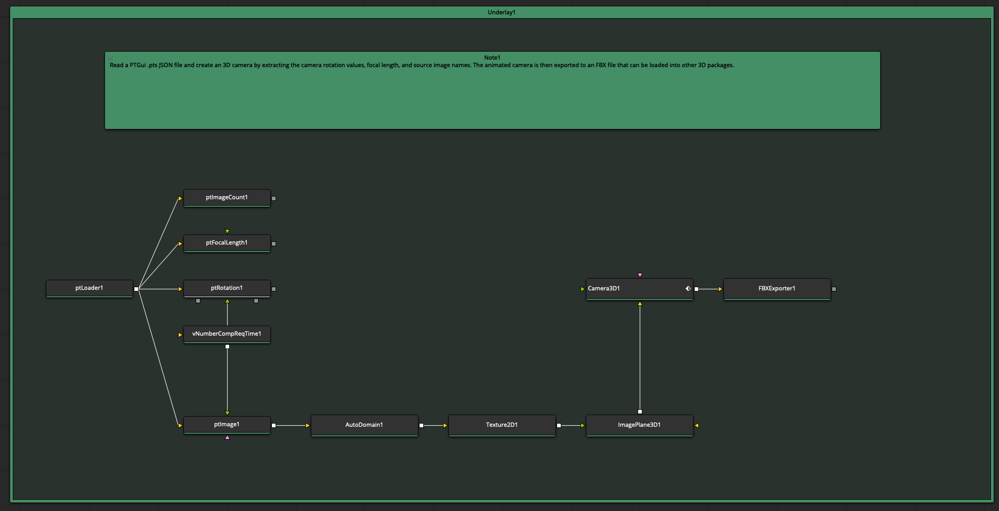

# Kartaverse PT Data Nodes

By Andrew Hazelden <andrew@andrewhazelden.com>

## Overview

The Kartaverse "PT" data nodes allow you to access PTGui Pro v11-12 based .pts (JSON) 360VR stitching project files in Fusion using parametric node-based operators. The letters "PT" stand for Pano Tools. The PT fuse nodes make it easy to parametrically extract values from a .pts file. Changes made in the PTGui project file are automatically reflected in your Fusion node graph.

## Software Requirements

To run PT based workflows on your Resolve/Fusion system you will need the following tools:

- BMD Resolve (Free) / Resolve Studio v18.5+
- BMD Fusion Studio
- [Reactor Package Manager](https://www.steakunderwater.com/wesuckless/viewtopic.php?f=32&t=3067) (Free)
- [Vonk Ultra Data Nodes](https://gitlab.com/AndrewHazelden/Vonk) (via Reactor)
- [Kartaverse PT Data Nodes](https://github.com/Kartaverse/PT-Data-Nodes-Docs)

## Open Source Software License Term

- GPL v3

## Example Comps

Several [example Fusion comps](https://kartaverse.github.io/PT-Data-Nodes-Docs/#/examples) are included to show basic PTGui .pts project file driven nodal workflow concepts.

## Fuse Reference Guide

For more information about the individual PT nodes check out the [Fuse reference guide](https://kartaverse.github.io/PT-Data-Nodes-Docs/#/fuses).

## PT Node Categories

The PT data nodes are separated into the following categories and sub-categories based on the function they perform:

Flow
- ptSwitch
- ptWireless

Image
- ptImage
- ptOutputImage

IO
- ptLoader
- ptSaver

Mask
- ptMask

Matrix
- ptMatrix
- ptRotation

Number
- ptFocalLength
- ptImageCount
- ptImageSize
- ptLensCount

Point

Text
- ptDocFilename
- ptImageFilename
- ptOutputFilename

Utility
- ptBatchStitcher
- ptInfo
- ptOptimumOutputSize

## PT Node Usage

The Fusion node graph allows for the use of "data nodes". This nodal operator driven approach allows the individual node based input and output connections to pass the PTGui JSON encoded documents "down the flow" in a parametric fashion.

This is achieved by encoding the raw PTGui .pts information into a Fusion datatype called a "ScriptVal" which is represented by a Lua table structure. The PTGui data is passed between node input and output connections in a way that allows you to visually control the operations that dynamically access the records.

A PT node graph starts with either a "ptLoader" node that imports an existing PTGui .pts file from disk.

A "ptImage" node accesses the source images referenced in the .pts file.

A "ptOutputImage" node loads the final rendered panorama image that is referenced in the PTGui document.

A "ptMask" node accesses the hand painted masking data stored in the .pts file. This masking information from the ptMask node can be fed into a MatteControl node set to use a Garbage Matte input connection with a "Garbage Matte > Channel: Red" setting to apply the PTGui "exclude" red matte information to your footage.

The "ptInfo" node peeks into the contents of the live PTGui data stream. This is a handy diagnostic tool.

The "ptRotation" node allows you to directly access the XYZ rotation values for each PTGui source image. This rotation data can be used to rotate a Camera3D node.

The "ptMatrix" node allows you to send the XYZ rotation values for each PTGui source image to a Vonk Ultra 4x4 transform matrix.

The "ptFocalLength" node allows you to read each of the lenses in the PTGui file. This can be used to drive the focal length on a Camera3D node.

The "ptBatchStitcher" node sends a .pts project file to PTGui Pro for batch stitching via the command line. This allows you to embed an external stitching task inside a Fusion node graph.

## Known Issues

### Texture2D Node

If you want to connect the output from a "ptImage" or "ptmask" node to Fusion's 3D system, you have to pass the image data through a "Texture2D" node before connecting the image data to an image plane or mesh. If you don't use a Texture2D node as an intermediate step you will get an instant lockup in Fusion when you view the mesh with the texture map applied.

### ptSaver Node

PTGui is very picky about the .pts based JSON files it is willing to load. The ordering of elements and the structure of the file is very important. The ptSaver node at this time does not meet PTGui's file opening JSON standards for formatting.

