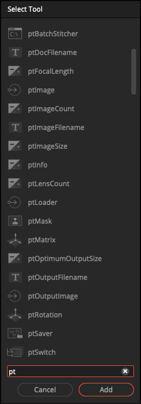

# Kartaverse PT Data Nodes

> The Kartaverse "PT" data nodes allow you to access PTGui Pro .pts (JSON) 360VR stitching project files in Resolve/Fusion using parametric node-based operators.

- Accelerate and automate your 360VR stitching workflows
- The Panotools integration plugin was made in West Dover, Nova Scotia, Canada 🇨🇦

## Overview

> The letters "PT" stand for "Panotools". The PT fuse nodes make it easy to parametrically extract values from a JSON encoded PTGui .pts file.

When you open the Fusion "Select Tools" dialog and type in the letters "pt" you will see a short list of the Panotools data nodes:

