# PT Data Node Example Comps

The Kartaverse "PT Data Nodes" allow you to access PTGui Pro v11-12 based .pts (JSON) 360VR stitching project files in Fusion using parametric node-based operators.

Listed on this page are the bundled example Fusion .comps that show basic PTGui .pts project file driven nodal workflow concepts.

These files are located on disk in the Reactor PathMap based folder:

        Reactor:/Deploy/Comps/Kartaverse/PT/Demo PT/

## Demo PT Output Image v001.comp

Read a PTGui .pts JSON file and load the final rendered panorama image that is referenced in the PTGui document.

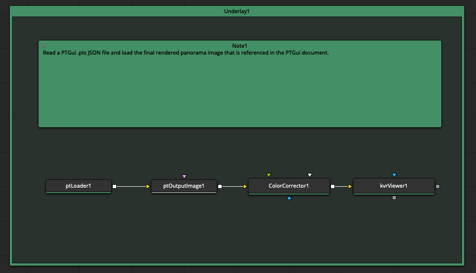

## Demo PT Batch Stitcher v001

Send the currently open .pts document to the PTGui Pro batch stitcher for processing.

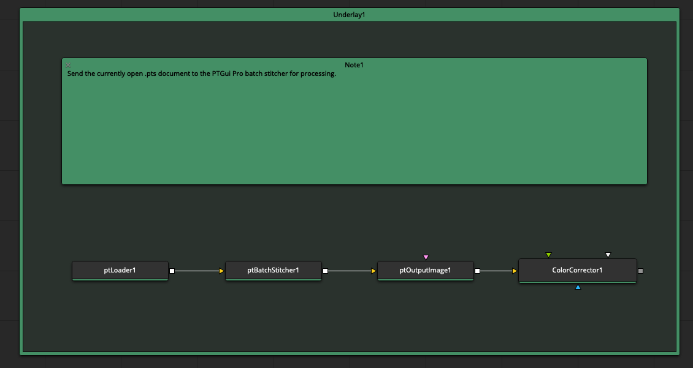

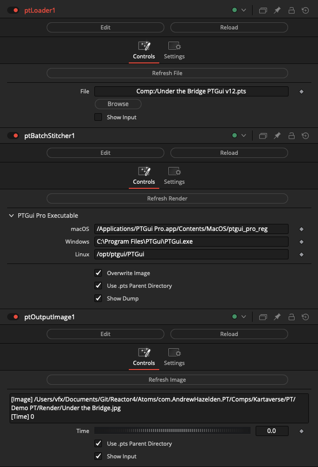

## Demo PT CSV Output v001.comp

Read a PTGui .pts JSON file and export a CSV spreadsheet

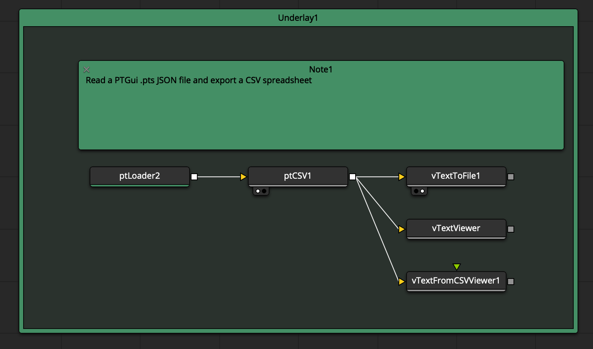

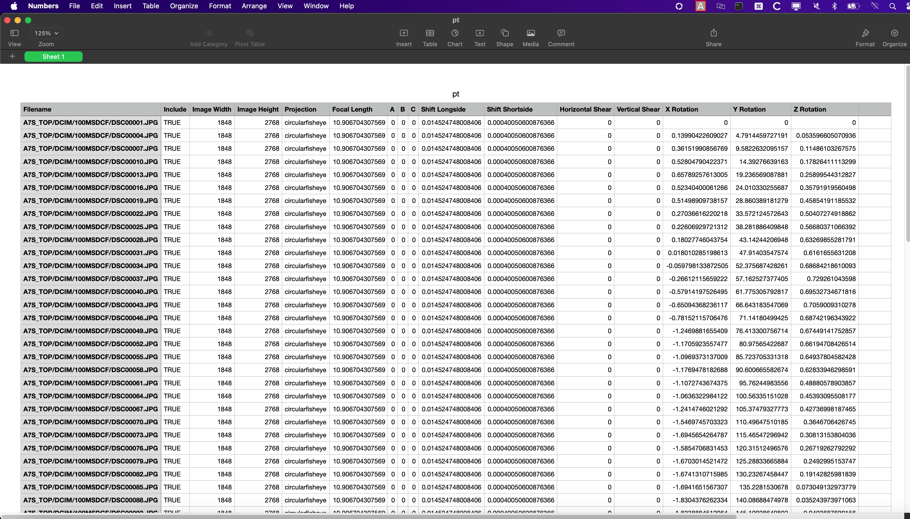

## Demo PT FBX Camera v001.comp

Read a PTGui .pts JSON file and create a 3D camera by extracting the camera rotation values, focal length, and source image names. The animated camera is then exported to an FBX file that can be loaded into other 3D packages.

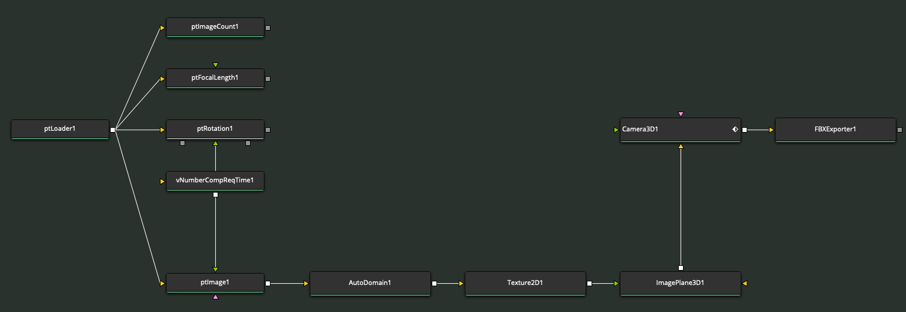

## Demo PT Generate IFL v001.comp

Read a PTGui .pts JSON file and create a new IFL (Image File List) text file by extracting all of the source image filenames.

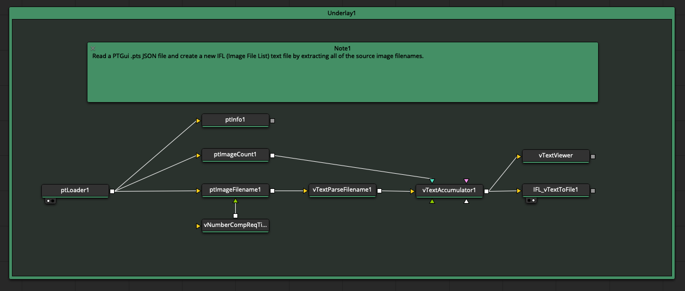

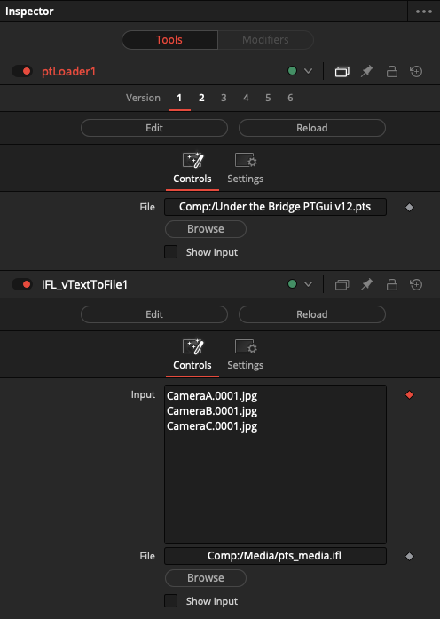

## Demo PT Load Images v001.comp

Read a PTGui .pts JSON file and load all of the source images.

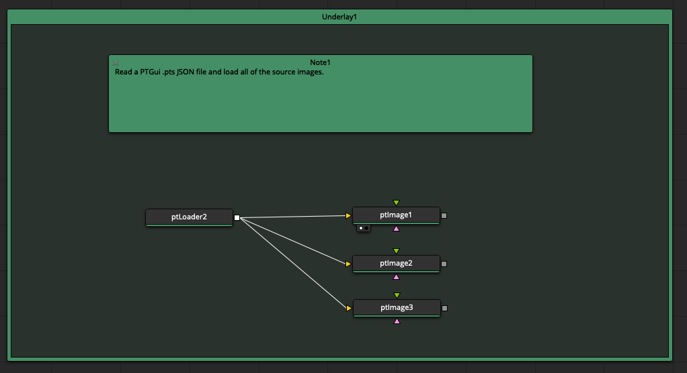

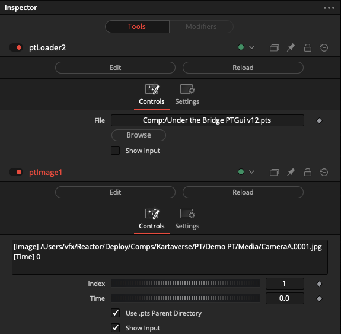

## Demo PT Mask v001.comp

Read a PTGui .pts JSON file and apply the exclude region masking data to a source image. The masking data is applied to the source image using a MatteControl node.

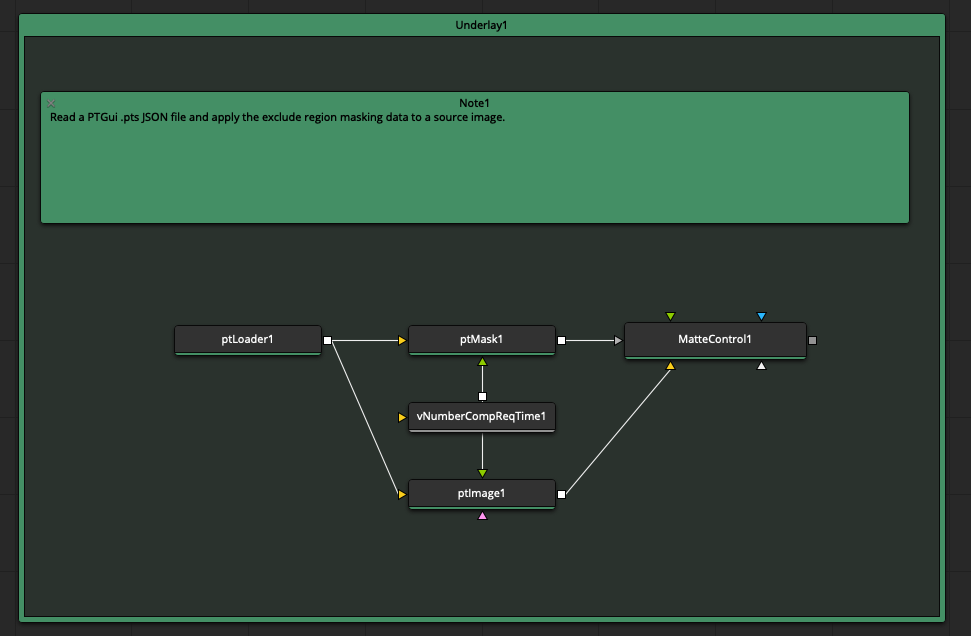

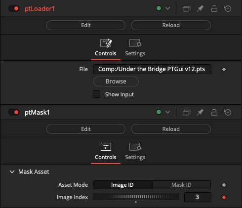

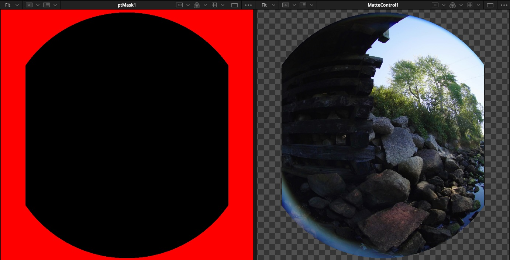

## Demo PT Optimal Output Image Size v001.comp

Read a PTGui .pts JSON file and calculate the optimal 360° panoramic output size based on the source image dimensions and the lens focal length.

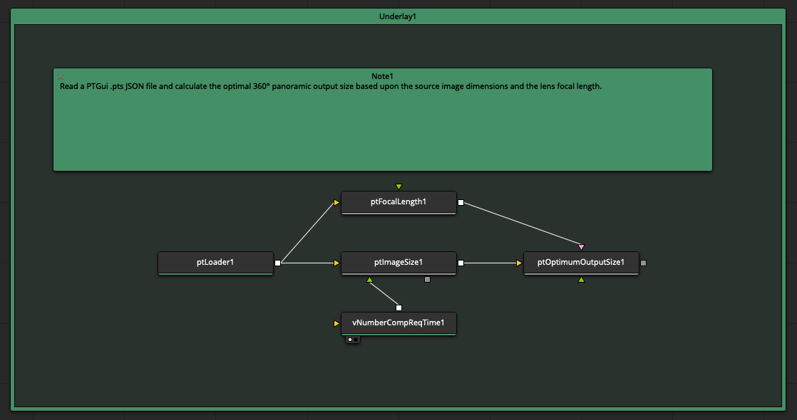

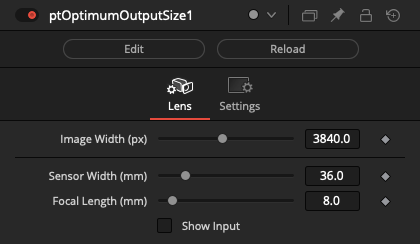

## Demo PT STMap Creation v001.comp

Edit the currently open .pts document so it generates STMap warping template images. Then send the modified .pts file to the PTGui Pro batch stitcher for processing.

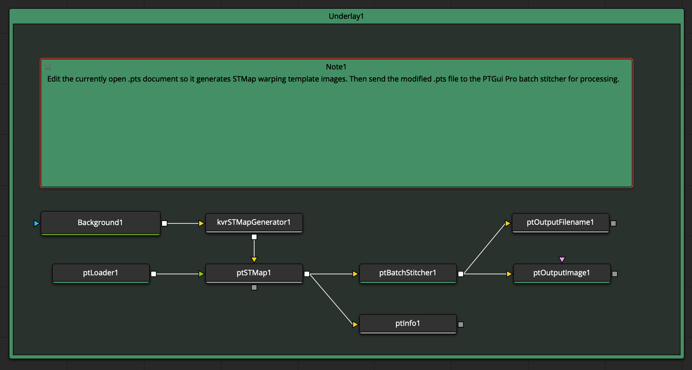

This is what the modified PTGui .pts file looks like when the source images are swapped out for the STMap gradient pattern images.

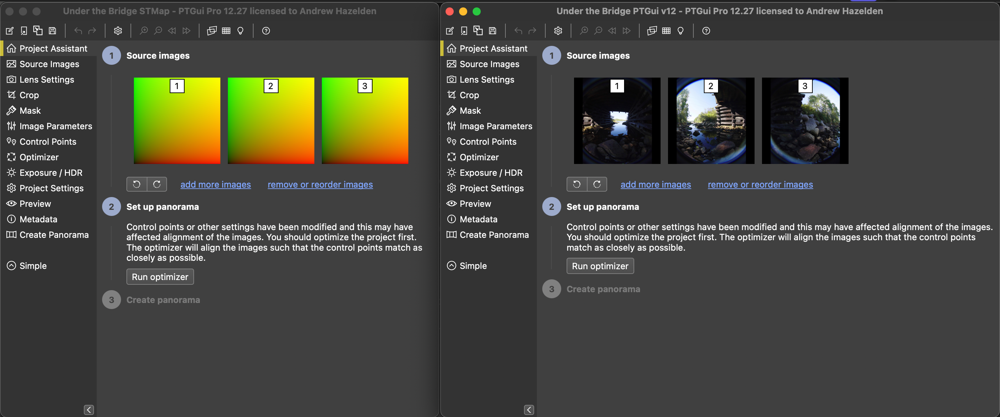

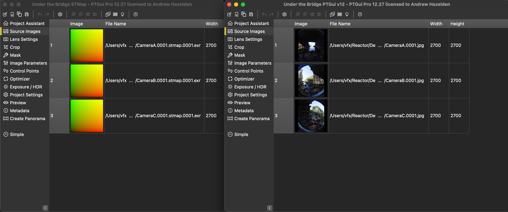

When using ptSTMap node based workflows, it is a good idea to use a "name.####.ext" approach to naming the source imagery in your .pts file. The source imagery that is present in the initial .pts file you import via a ptLoader node needs to have an image sequence style frame number at the end of the filename before the image filetype extension.

## Demo PT STMap Usage v001.comp

This example shows how to use an STMapper fuse to stitch a panoramic scene using a set of STMaps templates generated by the "Demo PT STMap Creation v001.comp" example. 

The STmaps need to have their frame range adjusted in the Loader node to handle loading a single frame from a numbered sequence.

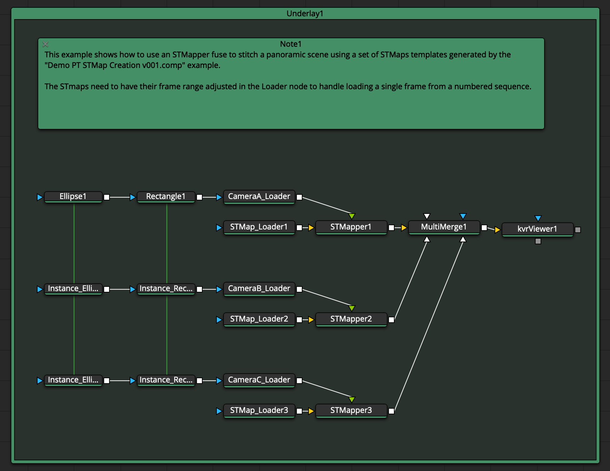
