# PT Data Node Fuses

The Kartaverse "PT" data nodes allow you to access PTGui Pro v11-12 based .pts (JSON) 360VR stitching project files in Fusion using parametric node-based operators. The letters "PT" stand for Pano Tools. The PT fuse nodes make it easy to parametrically extract values from a .pts file. Changes made in the PTGui project file are automatically reflected in your Fusion node graph.

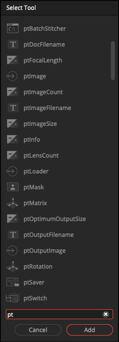

## Flow

### ptSwitch

The "ptSwitch" node allows you to toggle between several different ScriptVal based input connections to select which data stream you want to access.

The "Which" control on the ptSwitch node is used to select the current input connection you would like to access ScriptVal data from.

Typical Node Connections:

        ptLoader1 > ptSwitch1 > ptImage1
        ptLoader2 > ptSwitch1
        ptLoader3 > ptSwitch1

#### Comparing Multiple PTGui Files

A common use case for the ptSwitch node would be to allow you to have multiple ptLoder nodes in your comp at the same time. Each ptLoader node would be pointed at a specific .pts file that has slightly different settings. 

You can then change the ptSwitch node's "Which" control to cycle through the different PTGui .pts files quickly to compare the results in a consistent and organized fashion.

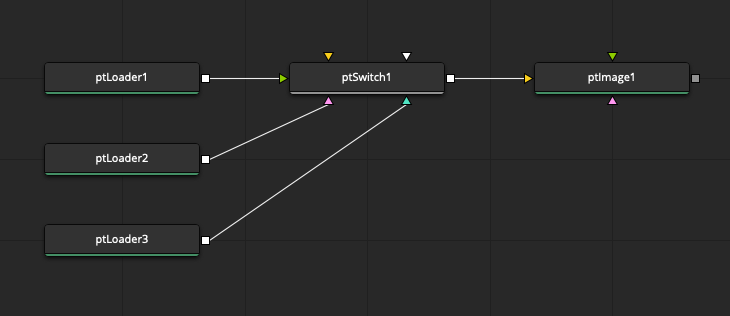

### ptWireless

The ptWireless node allows you to create links between nodes without displaying a wireline connection in the node graph. This can help make a complex comp tidy if there are wires crossing all over the place.

The Wireless link connection is created by holding down the middle mouse button, while dragging the node from the node graph into the Inspector window where the ptWireless node "Input" attribute is. The name of the connected node will be written into the text field.

Typical Node Connections:

        ptLoader > ptWireless > ptRotation > Camera3D

or 

        ptLoader > ptWireless > ptMask

or

        ptLoader > ptWireless > ptImage

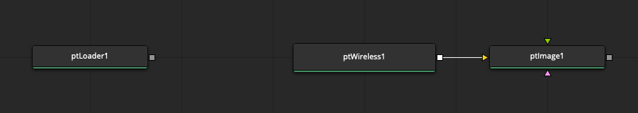

## Image

### ptImage

A "ptImage" node accesses the source images referenced in the .pts file.  The output is an image datatype.

The "Index" control allows you to cycle through each of the source images. If you move the Index control past the number of source images found in the .pts file it will hold on to the last image.

Typical Node Connections:

        ptLoader > ptImage > ColorCorrector

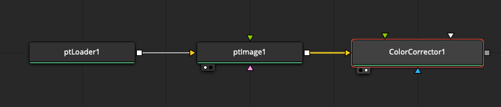

#### Image Sequence Handling

If the source image defined in the PTGui file is one frame from a longer image sequence, the "Time" control allows you to increment through subsequent images in the image sequence.

Image Sequence Filename Example:

        CameraA.[0001-0144].jpg

### ptOutputImage

The "ptOutputImage" node loads the final rendered panorama image that is referenced in the PTGui document. The output is an image datatype.

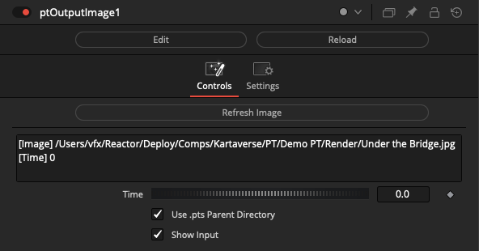

Typical Node Connections:

        ptLoader > ptOutputImage > ColorCorrector

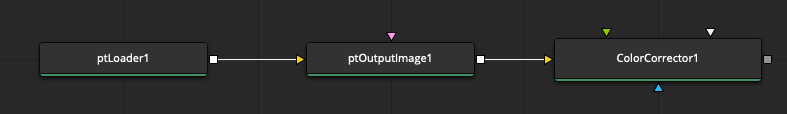

#### Specifying a Custom Filename in PTGui

In the PTGui "Create Panorama" tab it is possible to define sub-folders you would like a rendered image to be placed within. This is done by adding a folder name and a slash before the filename entered in the "Output File" text field:

        Render/Output.jpg

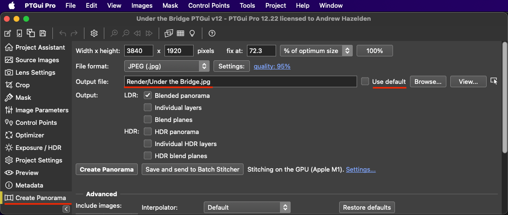

## IO

### ptLoader

A "ptLoader" node imports an existing PTGui .pts file from disk. The output from the ptLoader node is a Fusion ScriptVal data type that stores the PTGui information inside a Lua table structure that can be read by other nodes.

This node supports the use of Fusion "PathMaps". This allows short form values like "Comp:/" to be used when you want to define a .pts file as being located in the same based folder as the Fusion Studio .comp file.

### ptSaver

A "ptSaver" node exports the Fusion ScriptVal content back to a JSON file. 

This node supports the use of Fusion "PathMaps". This allows short form values like "Comp:/" to be used when you want to define a .pts file as being located in the same based folder as the Fusion Studio .comp file.

Note: PTGui is very picky about the .pts based JSON files it is willing to load. The ordering of elements and the structure of the file is very important. The ptSaver node at this time does not meet PTGui's file opening JSON standards for formatting.

## Mask

### ptMask

A "ptMask" node accesses the hand painted masking data stored in the .pts file. The output is an image datatype.

The "Asset Mode" control can be set to "Image ID" or "Mask ID".

When the "Image ID" mode is used you are accessing the masks based on the index number of the source images defined in the .pts file.

When the "Mask ID" mode is used you are accessing the masks based on the index number of the individual mask assets stored in the .pts file.

Typical Node Connections:

        ptLoader > ptMask1

#### Applying a PTGui Red Exclude Mask to an Image

The masking information from the ptMask node can be fed into a MatteControl node.

If you want to extract the "red" exclude masking information, use a Garbage Matte input connection with a "Garbage Matte > Channel: Red" setting to apply the PTGui "exclude" red matte information to your footage.

Typical Masking Connections:

        ptLoader.ScriptVal > ptMask1.ScriptVal
        ptMask1.Output > MatteControl.Garbage.Matte
        ptLoader.ScriptVal > ptImage.ScriptVal
        ptImage.Output > MatteControl.Background

## Matrix

### ptMatrix

The "ptMatrix" node allows you to send the XYZ rotation values for each PTGui source image to a Vonk Ultra 4x4 transform matrix.

The Vonk Ultra vMatrix nodes allow you to perform matrix math like addition, subtraction, and multiplication. This allows you to offset the position of the images on the fly.

Typical Node Connections:

        ptLoader > ptMatrix > vMatrixToRotation.Rotate.X > Camera3D.Transform3DOp.Rotate.X
        ptLoader > ptMatrix > vMatrixToRotation.Rotate.Y > Camera3D.Transform3DOp.Rotate.Y
        ptLoader > ptMatrix > vMatrixToRotation.Rotate.Z > Camera3D.Transform3DOp.Rotate.Z

### ptRotation

The "ptRotation" node allows you to directly access the XYZ rotation values for each PTGui source image. This rotation data can be used to rotate a Camera3D node.

Typical Node Connections:

        ptLoader > ptRotation.Rotate.X > Camera3D.Transform3DOp.Rotate.X
        ptLoader > ptRotation.Rotate.Y > Camera3D.Transform3DOp.Rotate.Y
        ptLoader > ptRotation.Rotate.Z > Camera3D.Transform3DOp.Rotate.Z

## Number

### ptFocalLength

The "ptFocalLength" node allows you to read the focal length value (in millimetres) for each of the lenses in the PTGui file. This can be used to drive the focal length on a Camera3D node.

The output is a number datatype.

The focal length value output by this node can also be used with the "ptOptimumOutputSize" node.

Typical Node Connections:

        ptLoader > ptFocalLength

### ptImageCount

The "ptImageCount" node returns the total number of source images in a PTGui .pts document.  The output is a number datatype.

Typical Node Connections:

        ptLoader > ptImageCount

### ptImageSize

The "ptImageSize" node returns the image width and image height parameters for a PTGui .pts source image. The output is a pair of number datatypes.

Typical Node Connections:

        ptLoader > ptImageSize

### ptLensABC

The "ptLensABC" node returns the PTGui A/B/C lens distortion values. This data can be used for lens distortion correction. The output is a set of three number datatypes.

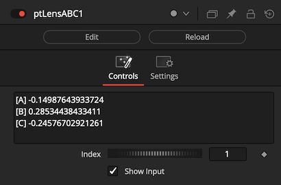

Typical Node Connections:

        ptLoader > ptLensABC

### ptLensCount

The "ptLensCount" node calculates the total number of PTGui Global Lens entries. The output is a number datatype.

Typical Node Connections:

        ptLoader > ptLensCount

## Point

## Text

### ptCSV

The "ptCSV" node allows you to extract data from a PTGui file and format it as a CSV (comma separated value) based spreadsheet. The output is a text datatype.

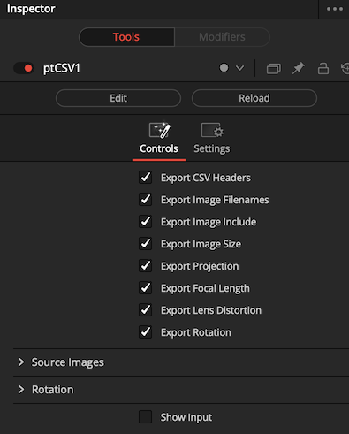

The checkbox "Export CSV Headers" saves out a header row at the top of the CSV file with labels for each column. 

The checkbox "Export Image Filename" saves out the source image filepath. If you enable the checkbox "Use .pts Parent Directory" then the relative filepath for the image filename will be expanded to an absolute filepath.

The checkbox "Export Image Include" saves out if the source image is enabled in the PTGui "Create Panorama > Advanced > Include Images" section. 

The checkbox "Export Image Size" saves out the source image width and height in pixels. 

The checkbox "Export Projection" saves out the source image lens model such as "circularfisheye".

The checkbox "Export Focal Length" saves out the value in mm (millimetres).

The checkbox "Export lens Distortion" saves out A/B/C distortion values, along with lens shift and shear properties.

The checkbox "Export Rotation" saves out the source image XYZ rotation values.

Sample CSV Output:

        Filename,Include,Image Width,Image Height,Projection,Focal Length,A,B,C,Shift Longside,Shift Shortside,Horizontal Shear,Vertical Shear,X Rotation,Y Rotation,Z Rotation,
        Media/CameraA.0001.jpg,true,2700,2700,circularfisheye,9.5785368257348,-0.14987643933724,0.28534438433411,-0.24576702921261,-0.00075907084037514,0.0030734326877189,0,0,-1.3043395671529,119.34915830069,0.44474477585746,
        Media/CameraB.0001.jpg,true,2700,2700,circularfisheye,9.5785368257348,-0.14987643933724,0.28534438433411,-0.24576702921261,-0.00075907084037514,0.0030734326877189,0,0,-1.3043395672987,0.027770169839528,-0.33601700522601,
        Media/CameraC.0001.jpg,true,2700,2700,circularfisheye,9.5785368257348,-0.14987643933724,0.28534438433411,-0.24576702921261,-0.00075907084037514,0.0030734326877189,0,0,-1.3043395669922,-119.34915830069,0.22850199695995,

Typical Node Connections:

        ptLoader > ptCSV > vTextToFile > vTextViewer

### ptImageFilename

The "ptImageFilename" node returns the source image filename that PTGui uses when loading an image from the .pts file. The output is a text datatype.

The "Asset Mode" control can be set to either to "Image ID" or "IFL".

When the "Image ID" mode is used you are accessing the image based on the index number of the source images defined in the .pts file.

When the "IFL" (Image File List) mode is used, a multi-line text block is returned with all of the source image filenames included in a one filename per-line format.

The "Parse" menu lets you choose if you want to extract a specific part of the returned filename. If you are outputting an IFL file, then the "Parse" control should be set to "FullName".

If you enable the checkbox "Use .pts Parent Directory" then the relative filepath for the image filename will be expanded to an absolute filepath.

Typical Node Connections:

        ptLoader > ptImageFilename > vTextViewer

### ptLensProjection

The "ptLensProjection" node returns the lens type that was used to photograph the source images. The output is a text datatype. 

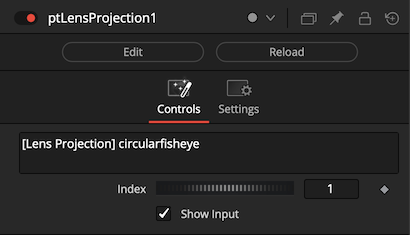

Typical Node Connections:

        ptLoader > ptLensProjection

A common lens projection value is "circularfisheye".

### ptOutputFilename

The "ptOutputFilename" node returns the filename that PTGui will use when saving a stitched panorama to disk. The output is a text datatype.

This information is based upon the value saved in the .pts file using the content defined in the PTGui "Create Panorama > Output file:" user interface control. This field can sometimes be empty.

The "Parse" menu lets you choose if you want to extract a specific part of the returned filename.

If you enable the checkbox "Use .pts Parent Directory" then the relative filepath for the image filename will be expanded to an absolute filepath.

Typical Node Connections:

        ptLoader > ptOutputFilename > vTextViewer

### ptDocFilename

The "ptDocFilename" node returns the filename of the PTGui .pts document that was specified in the ptLoader node. The output is a text datatype.

Typical Node Connections:

        ptLoader > ptDocFilename > vTextViewer

## Utility

### ptBatchStitcher

The "ptBatchStitcher" node sends a .pts project file to PTGui Pro for batch stitching via the command line. This allows you to embed an external stitching task inside a Fusion node graph. The filename for the .pts document to be stitched is defined using an upstream ptLoader node.

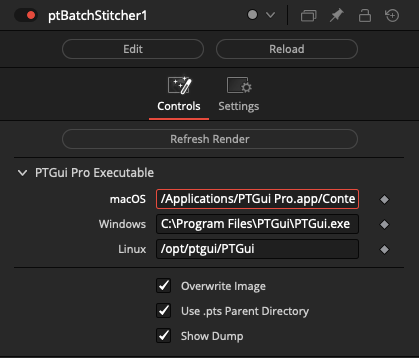

The "PTGui Pro Executable" section allows you to manually customize the program path used for locating PTGui Pro on disk.

The "Overwrite Image" checkbox allows to you decide if you want to skip the batch rendering task if the PTGui output image already exists on disk. This saves time by avoiding the re-rendering images if not desired.

The "Use .pts Parent Directory" checkbox is used when the "Overwrite Image" checkbox is disabled. It helps define the PTGui output filename if you are using a manual filename that is a relative filepath.

The "Show Dump" control allows you to see a diagnostic output in the Console window for the command line stitching task.
Typical Node Connections:

        ptLoader > ptBatchStitcher > ptOutputImage > ColorCorrector

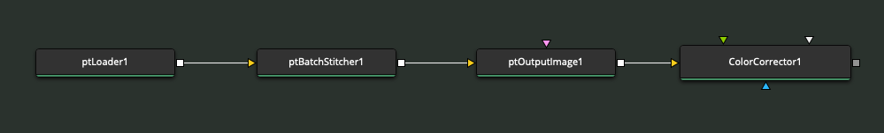

Note: The ptBatchStitcher node relies on a copy of PTGui Pro existing on your hard disk.

### ptInfo

The "ptInfo" node peeks into the contents of the live PTGui data stream. This is a handy diagnostic tool. The ptInfo input and output connections are ScriptVal datatypes.

Typical Node Connections:

        ptLoader > ptInfo

### ptOptimumOutputSize

This node allows you to calculate the best output size to use when stitching a 360VR panorama. This calculation is based upon the focal length (in mm), image sensor size (in mm), and the source image size (in pixels).

The output is a number datatype that represents the ideal LatLong image width in pixels.

The formula used for the optimum panoramic output size comes from the following PTGui documentation topics:  
[How does PTGui calculate the optimum output size of a panorama?](https://ptgui.com/support.html#3_26)

Typical Node Connections:

        ptLoader > ptFocalLength.Output > ptOptimumOutputSize.FocalLength
        ptLoader > ptImageSize.Width > ptOptimumOutputSize.ImageWidth
        vNumberCompReqTime > ptImageSize.Index

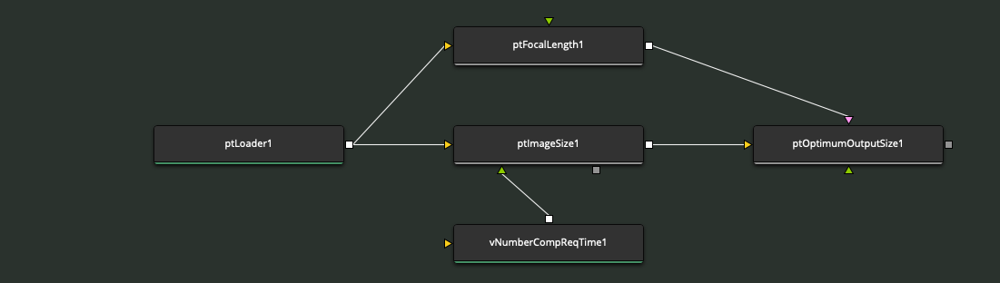
