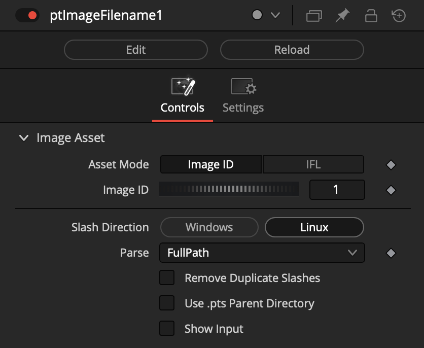
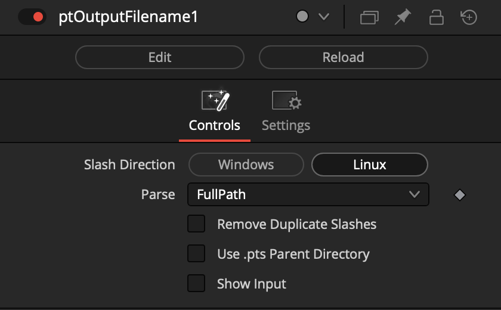
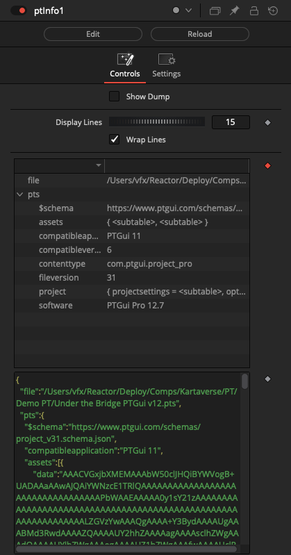

# PT Fuses

## Flow

### ptSwitch

### ptWireless

The ptWireless node allows you to create links between nodes without displaying a wireline connection in the node graph. This can help make a complex comp tidy if there would be wires crossing all over the place.

The Wireless link connection is created by holding down the middle mouse button, while dragging the node from the node graph into the Inspector window where the ptWireless node "Input" attribute is. The name of the connected node will be written into the text field.

Typical Node Connections:

        ptLoader > ptWireless > ptImage
        ptLoader > ptWireless > ptMask

or 

        ptLoader > ptWireless > ptRotation > Camera3D

## Image

### ptImage

A "ptImage" node accesses the source images referenced in the .pts file.

The "Index" control allows you to cycle through each of the source images. If you move the Index control past the number of source images found in the .pts file it will hold on the last image.

Typical Node Connections:

        ptLoader > ptImage 

#### Image Sequence Handling

If the source image defined in the PTGui file is one frame from a longer image sequence, the "Time" control allows you to increment through subsequent images in the image sequence.

Image Sequence Filename Example:

        CameraA.[0001-0144].jpg

## IO

### ptLoader

A "ptLoader" node imports an existing PTGui .pts file from disk.

This node supports the use of Fusion "PathMaps". This allows short form values like "Comp:/" to be used when you want to define a .pts file as being located in the same based folder as the Fusion Studio .comp file.

### ptSaver

A "ptSaver" node exports the ScriptVal content back to a JSON file. 

This node supports the use of Fusion "PathMaps". This allows short form values like "Comp:/" to be used when you want to define a .pts file as being located in the same based folder as the Fusion Studio .comp file.

Note: PTGui is very picky about the .pts based JSON files it is willing to load. The ordering of elements and the structure of the file is very important. The ptSaver node at this time does not meet PTGui's file opening JSON standards for formatting.

## Mask

### ptMask

A "ptMask" node accesses the hand painted masking data stored in the .pts file.

The "Asset Mode" control can be set to "Image ID" or "Mask ID".

When the "Image ID" mode is used you are accessing the masks based upon the index number of the source images defined in the .pts file.

When the "Mask ID" mode is used you are accessing the masks based upon the index number of the individual mask assets stored in the .pts file.

#### Applying a PTGui Red Exclude Mask to an Image

The masking information from the ptMask node can be fed into a MatteControl node.

If you want to extract the "red" exclude masking information, use a Garbage Matte input connection with a "Garbage Matte > Channel: Red" setting to apply the PTGui "exclude" red matte information to your footage.

Typical Masking Connections:

        ptLoader.ScriptVal > ptMask1.ScriptVal
        ptMask1.Output > MatteControl.Garbage.Matte
        ptLoader.ScriptVal > ptImage.ScriptVal
        ptImage.Output > MatteControl.Background

## Matrix

### ptMatrix

The "ptMatrix" node allows you to send the XYZ rotation values for each PTGui source image to a Vonk Ultra 4x4 transform matrix.

The Vonk Ultra vMatrix nodes allow you to perform matrix math like addition, subtraction, and multiplication. This allows you to offset the position of the images on the fly.

Typical Node Connections:

        ptLoader > ptMatrix > vMatrixToRotation > Camera3D

### ptRotation

The "ptRotation" node allows you to directly access the XYZ rotation values for each PTGui source image. This rotation data can be used to rotate a Camera3D node.

Typical Node Connections:

        ptLoader > ptRotation > Camera3D

## Number

### ptFocalLength

The "ptFocalLength" node allows you to read the focal length value (in millimetres) for each of the lenses in the PTGui file. This can be used to drive the focal length on a Camera3D node.

The focal length value output by this node can also be used with the "ptOptimumOutputSize" node.

### ptImageCount

The "ptImageCount" node returns the total number of source images in a PTGui .pts document.

### ptImageSize

The "ptImageSize" node returns the image width and height parameters for a PTGui .pts source image.

### ptLensCount

The "ptLensCount" node calculates the total number of PTGui Global Lens entries.

## Point

## Text

### ptImageFilename

The "ptImageFilename" node returns the source image filename that PTGui uses when loading an image from the .pts file.

If you enable the checkbox "Use .pts Parent Directory" then the relative filepath for the image filename will be expanded to an absolute filepath.

### ptOutputFilename

The "ptOutputFilename" node returns the filename that PTGui will use when saving a stitched panorama to disk.

This information is based upon the value saved in the .pts file using the content defined in the PTGui "Create Panorama > Output file:" user interface control. This field can sometimes be empty.

If you enable the checkbox "Use .pts Parent Directory" then the relative filepath for the image filename will be expanded to an absolute filepath.

## Utility

### ptInfo

The "ptInfo" node peeks into the contents of the live PTGui data stream. This is a handy diagnostic tool.

### ptOptimumOutputSize

This node allows you to calculate the best output size to use when stitching a 360VR panorama. This calculation is based upon the focal length (in mm), image sensor size (in mm), and the source image size (in pixels).

The formula used for the optimum panoramic output size comes from the following PTGui documentation topics:  
[How does PTGui calculate the optimum output size of a panorama?](https://ptgui.com/support.html#3_26)

