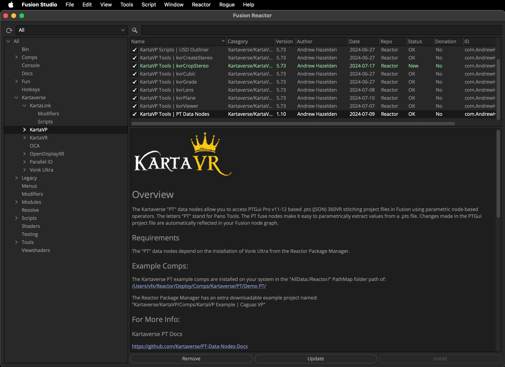
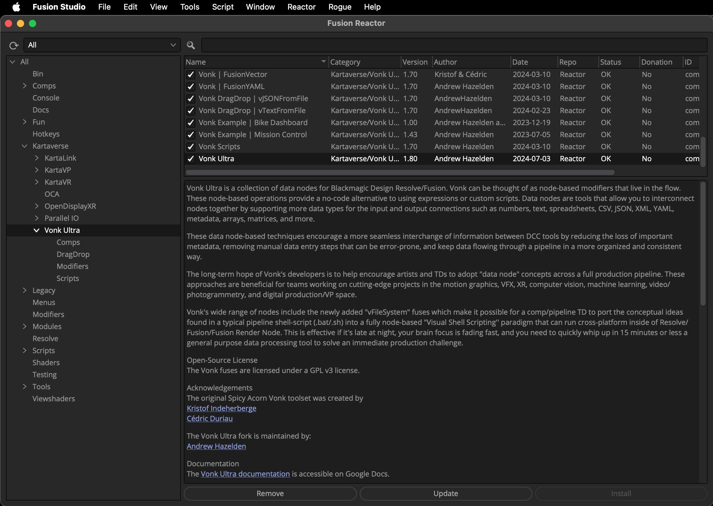

# Reactor Package Manager

The Pantools nodes are delivered using the [Reactor Package Manager](https://kartaverse.github.io/Reactor-Docs/#/reactor) for Resolve/Fusion.

## PT Data Nodes Atom Package

> The Panotool data nodes allow you to "level up" your skills, and tackle challenging stitching workflows

The Kartaverse "PT" data nodes allow you to access PTGui Pro .pts (JSON) 360VR stitching project files in Fusion using parametric node-based operators. 

> Install the "Panotool Data Nodes" toolset from Reactor. Select the "Kartaverse/KartaVP" category on the left sidebar. Then click on the ✅ checkbox to the left of the "PT Data Nodes" atom package name to install it.

## Vonk Ultra Atom Package

> Vonk Ultra lets you take your XR workflows to the next level!

[Vonk Ultra](https://gitlab.com/AndrewHazelden/Vonk) data nodes make it easy to manage a fusion comp that has multiple branches of Panotools node. This approach provides a high degree of control over challenging multi-view stitching workflows.

> Install the "Vonk Ultra" data node toolset from Reactor. Select the "Kartaverse/Vonk Ultra" category on the left sidebar. Then click on the ✅ checkbox to the left of the "Vonk Ultra" atom package name to install it.

