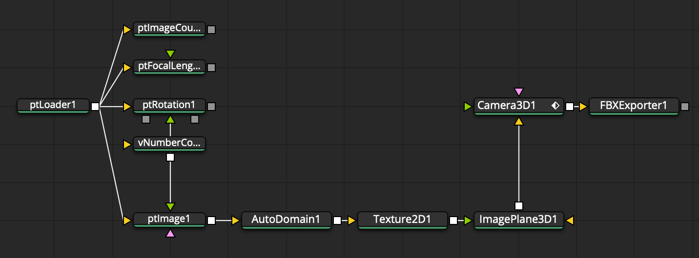

# Node Usage

## Nodal Operators

With a `ptLoader` node, changes you make in the external PTGui Pro .pts (JSON) project file are automatically reflected in Fusion. 

> The JSON data is parsed automatically so the records flow down the data node driven node graph as a Fusion object called a "ScriptVal" datatype:

## Data Node Concepts

The Fusion node graph allows for the use of "data nodes". This nodal operator driven approach allows the individual node based input and output connections to pass the PTGui JSON encoded documents "down the flow" in a parametric fashion.

This is achieved by encoding the raw PTGui .pts information into a Fusion datatype called a "ScriptVal" which is represented by a Lua table structure. The PTGui data is passed between node input and output connections in a way that allows you to visually control the operations that dynamically access the records.

## Node Categories

The PT data nodes are separated into the following categories and sub-categories based on the function they perform:

**Flow**
- ptSwitch
- ptWireless

**Image**
- ptImage
- ptOutputImage

**IO**
- ptLoader
- ptSaver

**Mask**
- ptMask

**Matrix**
- ptMatrix
- ptRotation

**Number**
- ptFocalLength
- ptImageCount
- ptImageSize
- ptLensCount

**Point**

**Text**
- ptCSV
- ptDocFilename
- ptImageFilename
- ptOutputFilename

**Utility**
- ptBatchStitcher
- ptInfo
- ptOptimumOutputSize

## Nodal Operators

A PT node graph starts with a `ptLoader` node that imports an existing PTGui .pts file from disk.

A `ptImage` node accesses the source images referenced in the .pts file.

A `ptOutputImage` node loads the final rendered panorama image that is referenced in the PTGui document.

A `ptMask` node accesses the hand painted masking data stored in the .pts file. This masking information from the ptMask node can be fed into a MatteControl node set to use a Garbage Matte input connection with a "Garbage Matte > Channel: Red" setting to apply the PTGui "exclude" red matte information to your footage.

The `ptInfo` node peeks into the contents of the live PTGui data stream. This is a handy diagnostic tool.

The `ptRotation` node allows you to directly access the XYZ rotation values for each PTGui source image. This rotation data can be used to rotate a Camera3D node.

The `ptMatrix` node allows you to send the XYZ rotation values for each PTGui source image to a Vonk Ultra 4x4 transform matrix.

The `ptFocalLength` node allows you to read each of the lenses in the PTGui file. This can be used to drive the focal length on a Camera3D node.

The `ptBatchStitcher` node sends a .pts project file to PTGui Pro for batch stitching via the command line. This allows you to embed an external stitching task inside a Fusion node graph. This node has been tested on macOS, Windows, and Linux with PTGui Pro v12.

The `ptCSV` node allows you to extract data from a PTGui file and format it as a CSV (comma separated value) based spreadsheet.
